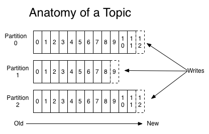
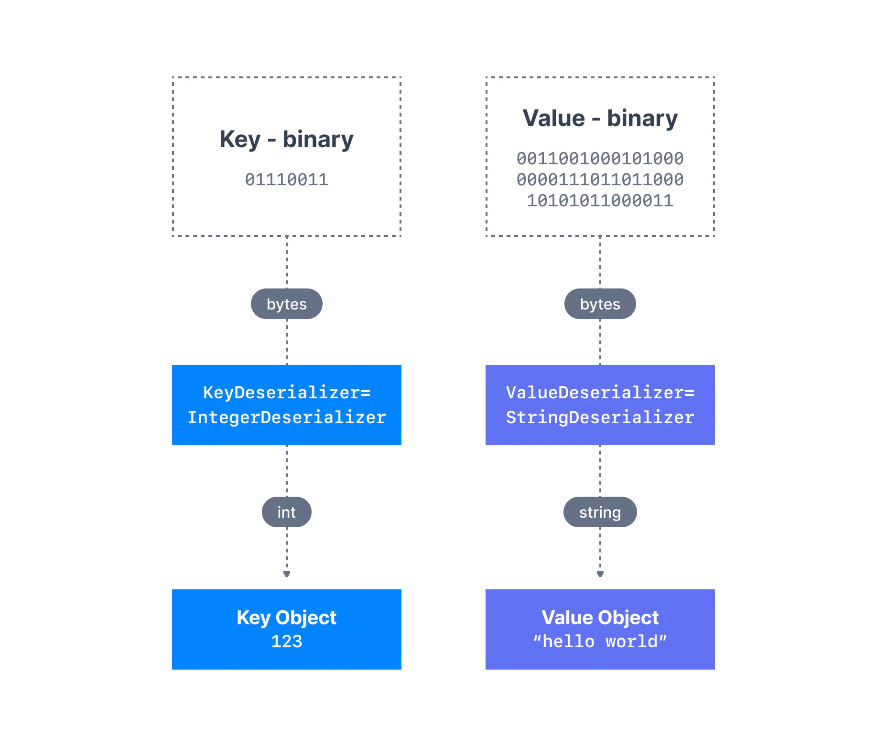
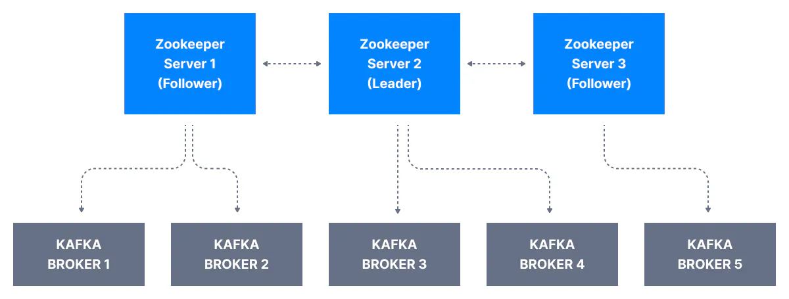

<!-- 788, 1012, 1861 -->

<!-- PROJECT LOGO -->
<br />
<div align="center">
  <a href="https://github.com/alifiroozi80/CKA/edit/main/Prometheus">
    
  </a>

<h3 align="center">Apache Kafka</h3>

  <p align="center">
    Apache Kafka is a distributed event store and stream-processing platform. 
  </p>
</div>
<br>
<div id="top">
<!-- TABLE OF CONTENTS -->
<details>
  <summary>Table of Contents</summary>
  <ol>
  <li>
     Introduction to Apache Kafka
    <ul>
        <li><a href="#Introduction-to-Apache-Kafka-What-is-Kafka">What is Kafka?</a></li>
        <li><a href="#Introduction-to-Apache-Kafka-Why-Kafka">Why Kafka?</a></li>
        <li><a href="#Introduction-to-Apache-Kafka-Kafka-Use-Cases">Kafka Use Cases</a></li>
        <li><a href="#Introduction-to-Apache-Kafka-Wrap-Up">Wrap Up</a></li>
    </ul>
  </li>
  <li>
     Kafka Concepts
    <ul>
        <li><a href="#Kafka-Concepts-Kafka-Topics">Kafka Topics</a>
          <ul>
            <li><a href="#Kafka-Concepts-Kafka-Topics-Partition-Offsets">Partition & Offsets</a></li>
            <li><a href="#Kafka-Concepts-Kafka-Topics-Replication">Replication</a></li>
          </ul>
        </li>
        <li><a href="#Kafka-Concepts-Kafka-Producers">Kafka Producers</a>
          <ul>
            <li><a href="#Kafka-Concepts-Kafka-Producers-Message-Keys">Message Keys</a></li>
            <li><a href="#Kafka-Concepts-Kafka-Producers-Message-Key-Hashing">Message Key Hashing</a></li>
            <li><a href="#Kafka-Concepts-Kafka-Producers-Message-Serializers">Message Serializers</a></li>
            <li><a href="#Kafka-Concepts-Kafka-Producers-Summary">Summary</a></li>
          </ul>
        </li>
        <li><a href="#Kafka-Concepts-Kafka-Consumer">Kafka Consumers</a>
          <ul>
            <li><a href="#Kafka-Concepts-Kafka-Consumer-Consumer-Deserializer">Consumer Deserializer</a></li>
            <li><a href="#Kafka-Concepts-Kafka-Consumer-Consumer-Groups">Consumer Groups</a></li>
            <li><a href="#Kafka-Concepts-Kafka-Consumer-Consumer-Offsets">Consumer Offsets</a></li>
            <li><a href="#Kafka-Concepts-Kafka-Consumer-Delivery-semantics-for-consumers">Delivery semantics for consumers</a></li>
            <li><a href="#Kafka-Concepts-Kafka-Consumer-Summary">Summary</a></li>
          </ul>
        </li>
        <li><a href="#Kafka-Concepts-Kafka-Brokers">Kafka Brokers</a>
          <ul>
            <li><a href="#Kafka-Concepts-Kafka-Brokers-Brokers-and-Topics">Brokers & Topics</a></li>
            <li><a href="#Kafka-Concepts-Kafka-Brokers-Kafka-Broker-Discovery">Kafka Broker Discovery</a></li>
          </ul>
        </li>
        <li><a href="#Kafka-Concepts-Producer-Acknowledgements-Topic-Durability">Producer Acknowledgements & Topic Durability</a>
          <ul>
            <li><a href="#Kafka-Concepts-Producer-Acknowledgements-Topic-Durability-Producer-Acknowledgements">Producer Acknowledgements (ACKs)</a></li>
            <li><a href="#Kafka-Concepts-Producer-Acknowledgements-Topic-Durability-Kafka-Topic-Durability">Kafka Topic Durability</a></li>
          </ul>
        </li>
        <li><a href="#Kafka-Concepts-Zookeeper">Zookeeper</a></li>
        <li><a href="#Kafka-Concepts-Kafka-with-Raft-KRaft">Kafka with Raft (KRaft)</a>
          <ul>
            <li><a href="#Kafka-Concepts-Kafka-with-Raft-KRaft-Kafka-KRaft-Architecture">Kafka KRaft Architecture</a></li>
            <li><a href="#Kafka-Concepts-Kafka-with-Raft-KRaft-Kraft-Performance-Improvemnts">Kraft Performance Improvemnts</a></li>
          </ul>
        </li>
        <li><a href="#Kafka-Concepts-Summery">Summery</a></li>
    </ul>
  </li>
  <li>
     Apache Kafka Installation
    <ul>
        <li><a href="#Apache Kafka-Installation-MacOS">MacOS</a>
          <ul>
            <li><a href="#Apache Kafka-Installation-MacOS-With-Zookeeper">Run Kafka with Zookeeper</a></li>
            <li><a href="#Apache Kafka-Installation-MacOS-Without-Zookeeper">Run Kafka without Zookeeper (KRaft)</a></li>
            <li><a href="#Apache Kafka-Installation-MacOS-Homebrew">Homebrew</a></li>
          </ul>
        </li>
        <li><a href="#Apache Kafka-Installation-Linux">Linux</a>
          <ul>
            <li><a href="#Apache Kafka-Installation-Linux-With-Zookeeper">Run Kafka with Zookeeper</a></li>
            <li><a href="#Apache Kafka-Installation-Linux-Without-Zookeeper">Run Kafka without Zookeeper (KRaft)</a></li>
          </ul>
        </li>
        <li><a href="#Apache Kafka-Installation-Windows">Windows</a>
          <ul>
            <li><a href="#Apache Kafka-Installation-Windows-With-Zookeeper">Run Kafka with Zookeeper</a></li>
            <li><a href="#Apache Kafka-Installation-Windows-Without-Zookeeper">Run Kafka without Zookeeper (KRaft)</a></li>
          </ul>
        </li>
        <li><a href="#Apache Kafka-Installation-Docker">Docker</a></li>
        <li><a href="#Apache Kafka-Installation-Kubernetes">Kubernetes</a></li>
        <li><a href="#Apache Kafka-Installation-Production-Installation">Production Installation</a></li>
    </ul>
  </li>
  <li>
      Kafka CLI Tutorial
    <ul>
        <li><a href="#Kafka-CLI-Tutorial-Introduction">Introduction</a></li>
        <li><a href="#Kafka-CLI-Tutorial-Kafka-Topic-CLI">Kafka Topic CLI</a></li>
        <li><a href="#Kafka-CLI-Tutorial-Kafka-Producer-CLI">Kafka Producer CLI</a></li>
        <li><a href="#Kafka-CLI-Tutorial-Kafka-Consumer-CLI">Kafka Consumer CLI</a></li>
    </ul>
  </li>
</ol>
</details>
</div>

---

# Introduction to Apache Kafka

## What is Kafka?

<div id="Introduction-to-Apache-Kafka-What-is-Kafka">

What is Apache Kafka?

According to [WikiPedia](https://en.wikipedia.org/wiki/Apache_Kafka), Apache Kafka is a distributed event store and stream-processing platform. It is an open-source system developed by the Apache Software Foundation written in Java and Scala. The project aims to provide a unified, high-throughput, low-latency platform for managing real-time data feeds.

But what the heck is that mean?

Let's explain it with an example:

Assume you have a **Source System** and a **Target System**, and a **Data** (in any format, lets keep it simple) has to be sent from **Source System** to **Target System**.

It is simple.

But, after a while, you probaly have many **Source Systems** and many **Target Systems**, and now, its very comlicated because with this, **All your Source Systems must send data to All of your Target Systems** to share information.


 
<sub>_image credit: [conduktor.io](www.conduktor.io)_</sub>

The formula is this:

> Source Systems * Target Systems

In the diagram above, we have `4` Source Systems and `4` target Systems, So we need a total of `16` connections (integrations).

Each connection(integration) comes with difficulties around:

* **Protocol** – how the data is transported ([TCP](https://en.wikipedia.org/wiki/Transmission_Control_Protocol), [HTTP](https://en.wikipedia.org/wiki/HTTP), [REST](https://en.wikipedia.org/wiki/REST), [FTP](https://en.wikipedia.org/wiki/File_Transfer_Protocol), [JDBC](https://en.wikipedia.org/wiki/Java_Database_Connectivity), etc)
* **Data format** – how the data is parsed ([Binary](https://en.wikipedia.org/wiki/Binary_number), [CSV](https://en.wikipedia.org/wiki/Comma-separated_values), [JSON](https://en.wikipedia.org/wiki/JSON), [Avro](https://en.wikipedia.org/wiki/Apache_Avro), etc)
* **Data schema & evolution** – how the data is shaped and may change

How to fix this problem?

AHA! **Apache Kafka** ✅

So, we still have our **Source Systems** and **Target Systems**, but this time, we have an Apache Kafka in the middle.

Now, here is what's happening:

1) The **Source Systems** is only responsible for sending data to Apache Kafka (one centralized place)
2) Kafka has all your data (from all **Source Systems**) within itself
3) If the **Target Systems** need the data, they will get it from Kafka


 
<sub>_image credit: [conduktor.io](www.conduktor.io)_</sub>

Now, let's see a real world example in a nice image:


 
<sub>_image credit: [conduktor.io](www.conduktor.io)_</sub>

</div> <!-- What is Kafka? -->

## Why Kafka?

<div id="Introduction-to-Apache-Kafka-Why-Kafka">

* Kafka created by [LinkedIn](https://www.linkedin.com) and released in `2011`
* Distributed, resilient architecto, fault torerant
* horizontal Scalibility:
  * Can scale to `50` brokers (We'll learn what is a _Broker_)
  * Can scale to millions of messages per seconds
* High Performance (Latency less than `10ms`)
* Used by most the big comanies and Banks

</div> <!-- Why Kafka? -->

## Kafka Use Cases
<div id="Introduction-to-Apache-Kafka-Kafka-Use-Cases">

* Messaging systems
* Activity Tracking
* Gather metrics from many different locations, for example, IoT devices
* Application logs analysis
* De-coupling of system dependencies
* Integration with Big Data technologies like [Spark](https://spark.apache.org), [Flink](https://flink.apache.org), [Storm](https://storm.apache.org), [Hadoop](https://hadoop.apache.org).
* Event-sourcing store

</div> <!-- Kafka Use Cases -->

## Wrap Up
<div id="Introduction-to-Apache-Kafka-Wrap-Up">

In this section, we found what is Kafka in why we should use it in a simple word.

So, if you want more to know and dig deeper, check the below resources:

* [Conduktor Docs](https://www.conduktor.io/kafka/what-is-apache-kafka)
* [Kafka Docs](https://kafka.apache.org/documentation/#introduction)

See you in the next chapter. 🍻

</div> <!-- Wrap Up --> 

<p align="right">(<a href="#top">back to top</a>)</p>

# Kafka Concepts

## Kafka Topics
<div id="Kafka-Concepts-Kafka-Topics">

* Kafka topics are the **categories used to organize messages**.
* In other words: Topics are a particular **stream of data**.
* They are like a table in a SQL Database (Without any Constraints, because you send whatever you want in a Kafka Topic, and there is no data verification)
* You can have as many Topics as you want in your Kafka Cluster (Just like you can have any number of Table in your SQL database)
* A Topic is identified by **its name**.
* A topic can accept **any kind of message** format (JSON, Avro, Binary, Text File, etc.)
* **The Sequence of messages is called a Data Stream** (that's why people call Kafka a Data Stream Platform!)
* **You can NOT query Topics** (Like you would query a Table in a SQL Database), instead, you should use Kafka Producer to send data and Kafka Consumer to read the data (Don't worry, we will learn what are those really soon (In this chapter))


 
<sub>_image credit: [conduktor.io](www.conduktor.io)_</sub>

### Partition & Offsets
<div id="Kafka-Concepts-Kafka-Topics-Partition-Offsets">

* Topics are split into Partitions (Like replicas in Distributed Systems e.g. Kubernetes Cluster)
* Every Topic in the whole world is broken down into a number of partitions.
* A single topic may have more than one partition.
* Every message that you send to the Kafka cluster is saved in a Topic and then a Partition
* Each message within a partition gets an **incremental ID**, called an **offset**
* Kafka Topics are **immutable**: Once data is written to a partition, it can not be changed


 
<sub>_image credit: [dattell.com](https://dattell.com/data-architecture-blog)_</sub>

Read this real world example of a Kafka Topic in the [Conduktor website](https://www.conduktor.io/kafka/kafka-topics/#Kafka-Topic-example-2).

---

* Once the data is written to a partition, it can not be changed (Immutable)
* Data is kept only for a limited time (Default is once a week - Configurable)
* Offset only have a meaning for a specific partition
  * E.g. Offset `3` in partition `0` doesnt represent the same data as offset `3` in partition `1`
  * Offsets are not re-used even if previous message have been deleted
* Order is guaranteed only within a partition (NOT Across partition)
* Data is assigned randomly to a partition unless a key is provided (More on that later)
* You can have as many partitions per topic as you want


</div> <!-- Partition & Offsets -->

### Replication
<div id="Kafka-Concepts-Kafka-Topics-Replication">

**One of the main reasons for Kafka's popularity is its resilience in the face of broker failures.**

Machines fail, and often, we cannot predict when that will happen or prevent it. Kafka is designed to withstand these failures with replication as a core feature while maintaining uptime and data accuracy.

* In Kafka, replication means that data is written down not just to one broker but to many. 
* The replication factor is a topic setting specified at topic creation time. 
* A replication factor of `1` means no replication. It is mainly used for development purposes and should be avoided in test and production Kafka clusters. 
* A replication factor of `3` is commonly used as it provides the right balance between broker loss and replication overhead.

In the cluster below consisting of three brokers, the replication factor is `2`. When a message is written down into Partition `0` of `Topic-A` in Broker `101`, it is also written down into Broker `102` because it has Partition `0` as a replica.


 
<sub>_image credit: [conduktor.io](www.conduktor.io)_</sub>

---

#### Leader for Partition

* For a given topic partition, the cluster designated **ONE** Kafka broker to be responsible for sending and receiving data to clients. 
* That broker is known as the **Leader** broker of that topic partition. 
* Any other broker storing replicated data for that partition is called a **Replica**.
* Therefore, each partition has **one leader** and **multiple replicas**. (We'll see that in the installation section)

##### What are In-Sync Replicas (ISR)?

An **ISR** is a replica that is up to date with the leader broker for a partition. 

Any replica that is not updated with the leader is out of sync.

---

Here we have Broker `101` as Partition `0` leader and Broker `102` as the leader of Partition `1`.

Broker `102` is a replica for Partition `0` and Broker `103` is a replica for Partition `1`.

If the leader broker were to fail, one of the replicas will be elected as the new partition leader by an election.


 
<sub>_image credit: [conduktor.io](www.conduktor.io)_</sub>

---

##### Summary

* Only ONE broker can be a leader for a given partition at anytime.
* Producers (Those components responsible for sending data to the Kafka cluster) can **ONLY** send data to the broker, that is, the leader of a partition's leader.
* The other brokers will replicate the data.
* Therefore, each partition has one leader and multiple ISR (In-Sync-Replica)
* Consumers (Those components that are responsible for reading data from the Kafka cluster), by default, will read from the leader broker for a partition
* Since [Kafka `2.4`](https://archive.apache.org/dist/kafka/2.4.0/RELEASE_NOTES.html), it is possible to configure Consumers to read from the closest replica
* This may help improve latency and also decrease network costs if using the cloud

</div> <!-- Replication -->
</div> <!-- Kafka Topics -->

## Kafka Producers
<div id="Kafka-Concepts-Kafka-Producers">

Alright!
Until now, we've learned that the data will be written on Topics (made of partitions).
Now, the question is: How can we send data to topics?

Here is where the Producers come in.

---

* Applications that send data into topics are known as Kafka producers. 
* Producers know to which partition to write (and which Kafka broker has it)
* In case of Kafka broker failures, Producers will automatically recover
* A Kafka producer sends messages to a topic, and messages are distributed to partitions according to a mechanism such as key hashing (more on that later).
* Each partition is going to receive message from one or more Producers


 
<sub>_image credit: [conduktor.io](www.conduktor.io)_</sub>

### Message Keys
<div id="Kafka-Concepts-Kafka-Producers-Message-Keys">

* Producers can send an **Optional Key** with the message (String, Number, Binary, etc.)
* If `key=null`, then data is being sent with the Round Robin algorithm
* If `key!=null`, then all messages for that key will always go to the same partition (Hashing)
* A ket is typically sent if you need message ordering for a specific field. (e.g. Ids)

</div> <!-- Message Keys -->

### Message Key Hashing
<div id="Kafka-Concepts-Kafka-Producers-Message-Key-Hashing">

* A Kafka partitioner is a code logic that takes a record and determines to which partition to send it into.
* **Key Hashing** is the process of determining the mapping of a key to a partition
* In the default Kafka partitioner, the keys are hashed using the [murmur2 algorithm](https://en.wikipedia.org/wiki/MurmurHash), with the formula below:

```text
targetPartition = Math.abs(Utils.murmur2(keyBytes)) % (numPartitions - 1)
```

</div> <!-- Message Key Hashing -->

### Message Serializers
<div id="Kafka-Concepts-Kafka-Producers-Message-Serializers">

* Kafka only accepts bytes as input from producers and sends bytes ou as output to consumers
* Message Serialization means transforming objects/data into bytes
* They are used on the value and the key
* Common Serializers are Strings, Integer, Float, Avro, Protobuff, etc


 
<sub>_image credit: [conduktor.io](www.conduktor.io)_</sub>

</div> <!-- Message Serializers -->

### Summary
<div id="Kafka-Concepts-Kafka-Producers-Summary">

Kafka messages are created by the producer. A Kafka message consists of the following elements:


 
<sub>Structure of a Kafka Message</sub>

* **Key.** Key is optional in the Kafka message and it can be null. A key may be a string, number, or any object and then the key is serialized into binary format.

* **Value.** The value represents the content of the message and can also be null. The value format is arbitrary and is then also serialized into binary format.

* **Compression Type.** Kafka messages may be compressed. The compression type can be specified as part of the message. Options are none, gzip, lz4, snappy, and zstd

* **Headers.** There can be a list of optional Kafka message headers in the form of key-value pairs. It is common to add headers to specify metadata about the message, especially for tracing.

* **Partition + Offset.** Once a message is sent into a Kafka topic, it receives a partition number and an offset id. The combination of topic+partition+offset uniquely identifies the message

* **Timestamp.** A timestamp is added either by the user or the system in the message.

</div> <!-- Summary -->

</div> <!-- Kafka Producers -->

## Kafka Consumers
<div id="Kafka-Concepts-Kafka-Consumer">

Alright!
Now that we've sent data to a topic, we want to read data from a topic. How can we do that?
You're right! 
**Consumers**

* Consumers read data from a topic (Identify by name)
* It is a **Pull** model (See below image). This means that Kafka consumers must request data from Kafka brokers in order to get it (instead of having Kafka brokers continuously push data to consumers). This implementation was made so that consumers can control the speed at which the topics are being consumed.
* Consumers automatically know which broker to read from
* in case of broker failures, consumers know how to recover
* Data is read in order from low to high offset **within each partition** and cannot read data backwards (More about Offset later)


 
<sub>_image credit: [conduktor.io](www.conduktor.io)_</sub>

### Consumer Deserializer
<div id="Kafka-Concepts-Kafka-Consumer-Consumer-Deserializer">

As we have seen before, the data sent by the Kafka producers is <a href="#Kafka-Concepts-Kafka-Producers-Message-Serializers">serialized</a>. This means that the data received by the Kafka consumers must be correctly deserialized in order to be useful within your application. 
Data being consumed must be deserialized in the same format it was serialized in. 

* Deserialize indicates how to transform bytes into objects/data
* They are used on the value of the key of the message
* Common Deserializers are Strings, Integer, Float, Avro, Protobuf, etc
* The Serialization/Deserialization type must NOT change during a Topic lifecycle


 
<sub>_image credit: [conduktor.io](www.conduktor.io)_</sub>

</div> <!-- Consumer Deserializer -->

### Consumer Groups
<div id="Kafka-Concepts-Kafka-Consumer-Consumer-Groups">

Consumers that are part of the same application and, therefore, performing the same "logical job" can be grouped together as a Kafka consumer group.

* All the consumers in an application read data as consumer groups
* Each consumer within a group reads from exclusive partitions


 
<sub>_image credit: [conduktor.io](www.conduktor.io)_</sub>

#### What if we have too many consumers?

* We now know that each consumer in a group reads from one or more partitions.
* It means if we have `3` partitions, we can have `1` or `2` or a **maximum of `3`** consumers in a group.
* If we have more consumers than partitions, some consumers will be inactive.


 
<sub>_image credit: [conduktor.io](www.conduktor.io)_</sub>

#### Multiple consumers on one topic

* In Apache Kafka, it is acceptable to have multiple consumer groups on the same topic
* To create distinct consumer groups, use the consumer property `group.id`

Each of your applications (that may be composed of many consumers) reading from Kafka topics must specify a different `group.id`.

That means that multiple applications (consumer groups) can consume from the same topic at the same time:


 
<sub>_image credit: [conduktor.io](www.conduktor.io)_</sub>

Why and When do you use Multiple Consumers on one topic?

A typical scenario would be a chat application: one consumer group for notifications, one for locations, one for messages, etc.

</div> <!-- Consumer Groups -->

### Consumer Offsets
<div id="Kafka-Concepts-Kafka-Consumer-Consumer-Offsets">

* Kafka brokers use an internal topic named `__consumer_offsets` that keeps track of what messages a given **consumer group** last successfully processed.
* Kafka stores the offsets at which a consumer group has been reading
* The offsets committed are in the Kafka topic named `___consumer_offsets`
* When a consumer in a group has processed data received from Kafka, it should be **periodically** committing the offsets (the Kafka brokers will write to `__consumer_offsets`, not the group itself)
* If a consumer dies, it can read back from where it left off, thanks to the committed offsets!

In the figure below, a consumer from the consumer group has consumed messages up to offset `4262`, so the consumer offset is set to `4262`.


 
<sub>_image credit: [conduktor.io](www.conduktor.io)_</sub>

</div> <!-- Consumer Offsets -->

### Delivery semantics for consumers
<div id="Kafka-Concepts-Kafka-Consumer-Delivery-semantics-for-consumers">

* By default, Java Consumers will automatically commit offsets (controlled by the `enable.auto.commit=true` property every `auto.commit.interval.ms` (`5` seconds by default))
* There are `3` delivery semantics if you choose to commit manually

1) **At least Once**
    * Offsets are committed after the message is processed
    * If the processing goes wrong, the message will be read again
    * This can result in duplicate messages being processed. Make sure your processing is idempotent (meaning re-processing the message won't impact your systems)
2) **At most once**
    * Offsets are committed as soon as messages are received
    * If the processing goes wrong, some messages will be lost (They won't read again)
3) **Exactly once**
    * Kafka topic to Kafka topic workflows: Use the Transactional API (easy with Kafka Streams API)
    * Kafka topic to External System workflows: Use an idempotent consumer

</div> <!-- Delivery semantics for consumers -->

### Summary
<div id="Kafka-Concepts-Kafka-Consumer-Summary">

Offsets are critical for many applications. If a Kafka client crashes, a rebalance occurs and the latest committed offset help the remaining Kafka consumers know where to restart reading and processing messages.

In case a new consumer is added to a group, another consumer group rebalance happens and consumer offsets are yet again leveraged to notify consumers where to start reading data from.

Therefore consumer offsets must be committed regularly.

</div> <!-- Summary -->
</div> <!-- Kafka Consumers -->

## Kafka Brokers
<div id="Kafka-Concepts-Kafka-Brokers">

Till now, we learned that a topic may have more than one partition.
Each partition may live on different servers, also known as Kafka brokers.

* A Kafka cluster is composed of multiple brokers (servers/nodes)
* Each broker is identified with its **unique ID** (integer)
* Each broker contains certain topic partitions
* After connecting to any broker (Called a bootstrap broker, more on that later), you will be connected to the entire cluster (Kafka clients have an intelligent mechanism for that)
* A good number to get started is `3` brokers (see below for more information)

---

<div id="Kafka-Concepts-quorum">

#### Number of brokers?

Why we said (A good number to get started is `3` brokers) here and in [Kubernets repo](https://github.com/alifiroozi80/CKA)?

This is because of the **quorum**.

So, every distributed system, whether a Kafka cluster or Kubernetes cluster or whatever is distributed, meaning they use the [Raft Algorithm](https://raft.github.io) in depth.

They use Leader Election (We'll see it in more detail later on), so it is best practice to keep the number of brokers/nodes/servers as an odd number for this purpose.

Why `3`?

With `1` broker/node/server, you have no HA (High Availability), `2` is an even number, and the nearest odd number is `3`.

That is why it is best practice for distributed systems to have **at least `3`** brokers/control planes/servers.

See the below links for more information (Order is matter here):

* [RAFT - Understandable Distributed Consensus](https://thesecretlivesofdata.com/raft)
* [Everything You Thought You Already Knew About Orchestration](https://www.youtube.com/watch?v=Qsv-q8WbIZY)
* [What is gossip protocol?](https://www.educative.io/answers/what-is-gossip-protocol)

</div> <!-- Kafka-Concepts-quorum -->

### Brokers & Topics
<div id="Kafka-Concepts-Kafka-Brokers-Brokers-and-Topics">

* In the figure below, the Kafka cluster is made up of three Kafka brokers.
* In the diagram below, two topics are illustrated - _Topic-A_ has three partitions. They are distributed evenly among the three available brokers in the cluster. _Topic-B_, in our case, has two partitions only. In this case, Broker `103` does not contain any partition of Topic-B.
* **There is no relationship between the broker ID and the partition ID** - Kafka does a good job of distributing partitions evenly among the available brokers. In case the cluster becomes unbalanced due to an overload of a specific broker, it is possible for Kafka administrators to rebalance the cluster and move partitions.


 
<sub>_image credit: [conduktor.io](www.conduktor.io)_</sub>

</div> <!-- Brokers & Topics -->

### Kafka Broker Discovery
<div id="Kafka-Concepts-Kafka-Brokers-Kafka-Broker-Discovery">

A client that wants to send or receive messages from the Kafka cluster **may connect to any broker in the cluster**. Every broker in the cluster has metadata about all the other brokers and will help the client connect to them as well; **therefore, any broker in the cluster is also called a bootstrap server**.

* Every Kafka broker is also called a "bootstrap server"
* This means that **you only need to connect to one broker**, and the Kafka clients will know how to be connected to the entire cluster (smart clients)
* Each broker knows about all brokers, topics and partitions (metadata)


 
<sub>_image credit: [conduktor.io](www.conduktor.io)_</sub>

</div> <!-- Kafka Broker Discovery -->

</div> <!-- Kafka Brokers -->

## Producer Acknowledgements & Topic Durability
<div id="Kafka-Concepts-Producer-Acknowledgements-Topic-Durability">

Here, we're learning two fundamental concepts about Producers and Topics.
I didn't spread these concepts among the <a href="#Kafka-Concepts-Kafka-Producers">Producers</a> and <a href="#Kafka-Concepts-Kafka-Topics">Topics</a> sections because I wanted you guys to learn the basics of those and Brokers and then understand these two.

### Producer Acknowledgements (ACKs)
<div id="Kafka-Concepts-Producer-Acknowledgements-Topic-Durability-Producer-Acknowledgements">

Kafka producers **only write data to the current leader broker for a partition**.

Kafka producers must also specify a level of acknowledgment acks to specify if the message must be written to a minimum number of replicas before being considered a successful write.

Producers can choose to receive acknowledgement of data writes:
* `acks=0`: Producers won't wait for an acknowledgement (Possible data loss)
* `acks=1`: Producers will wait for leader acknowledgement (Limited data loss)
* `acks=all`: leader & replicas acknowledgement (No data loss)

#### acks=0

When `acks=0` producers consider messages as "written successfully" the moment the message was sent without waiting for the broker to accept it at all.


 
<sub>_image credit: [conduktor.io](www.conduktor.io)_</sub>

#### acks=1

When `acks=1`, producers consider messages as "written successfully" when the message was acknowledged by only the leader.


 
<sub>_image credit: [conduktor.io](www.conduktor.io)_</sub>

#### acks=all

When `acks=all`, producers consider messages as "written successfully" when the message is accepted by all in-sync replicas (`ISR`).


 
<sub>_image credit: [conduktor.io](www.conduktor.io)_</sub>

</div> <!-- Producer Acknowledgements (ACKs) -->

---

The default value of acks has changed with Kafka [v3.0](https://archive.apache.org/dist/kafka/3.0.0/RELEASE_NOTES.html)
* if using Kafka **< v3.0**, `acks=1`
* if using Kafka **>= v3.0**, `acks=all`

### Kafka Topic Durability
<div id="Kafka-Concepts-Producer-Acknowledgements-Topic-Durability-Kafka-Topic-Durability">

* For a topic replication factor of `3`, topic data durability can withstand the loss of `2` brokers. 
* As a general rule, for a replication factor of `N`, you can permanently lose up to `N-1` brokers and still recover your data.

</div> <!-- Kafka Topic Durability -->

</div> <!-- Producer Acknowledgements & Topic Durability -->

## Zookeeper
<div id="Kafka-Concepts-Zookeeper">

How do the Kafka brokers and clients keep track of all the Kafka brokers if there is more than one? The Kafka team decided to use [Zookeeper](https://zookeeper.apache.org) for this purpose. 

* **Zookeeper is used to track cluster state, membership, and leadership**
* **Zookeeper is used for metadata management in the Kafka world**.
* Zookeeper manages Brokers (Keeps a list of them)
* Zookeeper helps perform leader election for partitions
* zookeeper sends notifications to Kafka in case of changes (e.g. new topic, broker timeout, new broker, remove topics, etc.)
* Since Zookeeper is a cluster itself, it should have an odd number of servers. (Because of the `quorum` that <a href="#Kafka-Concepts-quorum">we've talked</a> about.)
* Zookeeper has a leader among Zookeerp servers for writing, and the rest of the Zookeeper servers would be followers (read). We are going to see this in the coming sections.


 
<sub>_image credit: [conduktor.io](www.conduktor.io)_</sub>

---

### Important Note:

* Kafka `0.x`, `1.x` & `2.x` must use Zookeeper
* Kafka `3.x` can work without Zookeeper ([KIP-500](https://github.com/a0x8o/kafka/blob/master/KIP-500.md)) - Using Kafka Raft (KRaft) instead - but is not production ready yet
* Kafka `4.x` will not have Zookeeper

---

### Should we use Zookeeper?

* With Kafka Brokers?
  * Yes, Until Kafka `4.x` is out while waiting for Kafka without Zookeeper to be production-ready

* With Kafka clients?
  * Over time, the Kafka clients and CLI migrated to leverage the brokers as a connection endpoint instead of Zookeeper.
  * since Kafka [0.10](https://archive.apache.org/dist/kafka/0.10.1.0/RELEASE_NOTES.html), consumers store offset in Kafka and Zookeeper and must not connect to Zookeeper as the option is deprecated
  * Since Kafka [2.2](https://archive.apache.org/dist/kafka/2.2.0/RELEASE_NOTES.html), the `kafka-topics.sh` CLI command references Kafka brokers and not Zookeeper for topic management (creation, deletion, etc...) and the Zookeeper CLI argument is deprecated. 
  * All of the APIs and commands that were previously leveraging Zookeeper are migrated to use Kafka instead so that when clusters are migrated to be without Zookeeper, the change is invisible to clients.
  * Zookeeper is also less secure than Kafka, and therefore, Zookeeper ports should only be opened to allow traffic from Kafka brokers and not Kafka clients

**Therefore, to be a great modern-day Kafka developer, never ever use Zookeeper as a configuration in your Kafka clients and other programs that connect to Kafka**.

</div> <!-- Zookeeper -->

## Kafka with Raft (KRaft)
<div id="Kafka-Concepts-Kafka-with-Raft-KRaft">

* In 2020, the Apache Kafka project started to work to [remove the Zookeeper dependency](https://cwiki.apache.org/confluence/display/KAFKA/KIP-500%3A+Replace+ZooKeeper+with+a+Self-Managed+Metadata+Quorum) from it. ([KIP-500](https://github.com/a0x8o/kafka/blob/master/KIP-500.md))
* Zookeeper shows scaling issues when the Kafka cluster has more than `200,000` partitions
* By removing Zookeeper, Apache Kafka can:
  * Scale to millions of partitions and becomes easier to maintain and set up
  * Improve stability (Kafka cluster metadata is sometimes out-of-sync from Zookeeper)
  * making it easier to monitor, support and administer (Kafka clusters setup is difficult and depends on another component to setup)
  * Single security model for the whole system (Zookeeper security is lagging behind Kafka security)
  * A single process to start with Kafka 
  * Faster controller shutdown and recovery time

Kafka `3.X` now implements the Raft protocol (KRaft) in order to replicate the Zookeeper.

### Kafka KRaft Architecture
<div id="Kafka-Concepts-Kafka-with-Raft-KRaft-Kafka-KRaft-Architecture">


 
<sub>_image credit: [conduktor.io](www.conduktor.io)_</sub>


</div> <!-- Kafka KRaft Architecture -->

### Kraft Performance Improvemnts
<div id="Kafka-Concepts-Kafka-with-Raft-KRaft-Kraft-Performance-Improvemnts">


 
<sub>_image credit: [confluent.io](www.confluent.io)_</sub>

Read this article on KRaft: [Apache Kafka Made Simple: A First Glimpse of a Kafka Without ZooKeeper](https://www.confluent.io/blog/kafka-without-zookeeper-a-sneak-peek)

</div> <!-- Kraft Performance Improvemnts -->

</div> <!-- Kafka with Raft (KRaft) -->

## Summery
<div id="Kafka-Concepts-Summery">

Alright, we've learned A LOT of new stuff about Kafka. In theory.

We will implement and see all those theories in the following sections in real life!

I hope you guys are as excited as I am. 🍻

But before we get deeper, you should be sure that you know all these fundamental crucial theory concepts.

Here, let's summarise all of this quickly.

* Kafka Topics & Partitions & Replication
  * Kafka topics are the categories used to organize messages. Each topic has a name that is unique across the entire Kafka cluster. Messages are sent to and read from specific topics.
  * Partitioning takes the single topic log and breaks it into multiple logs, each of which can live on a separate node/broker/server in the Kafka cluster
  * Kafka topic replication is a technique which helps kafka to ensure high availability of a topic
* Kafka Producers
  * A Producer is a client application that publishes (writes) events to a Kafka cluster
* Kafka Consumers
  * An Consumer is a client application that subscribes to (reads and processes) events
* Kafka Producer Key
  * the key is used for partitioning. By default, Kafka producer relies on the key of the record to decide to which partition to write the record. For two records with the same key, the producer will always choose the same partition.
* Kafka Consumer Groups and Consumer Offsets
  * Consumer groups allow Kafka consumers to work together and process events from a topic in parallel
  * In order to "checkpoint" how far a consumer has been reading into a topic partition, the consumer will regularly commit the latest processed message, also known as consumer offset.
* Producer/Consumer Serialization/Deserialization
  * Serialization is the process of converting objects into bytes. Deserialization is the inverse process — converting a stream of bytes into an object. In a nutshell, it transforms the content into readable and interpretable information.
* Kafka Brokers
  * The Kafka broker can be defined as one of the core components of the Kafka architecture. It is also widely known as the Kafka server and a Kafka node.
* Zookeeper
  * ZooKeeper is a critical role in a Kafka cluster by providing distributed coordination and synchronization services. It maintains the cluster's metadata, manages leader elections, and enables consumers to track their consumption progress.
* KRaft Mode
  * Kafka Raft, or KRaft, aims to remove Kafka's dependency on Apache ZooKeeper. KRaft is based on the Raft consensus protocol and addresses several potential failures in large Kafka clusters.


 
<sub>_image credit: [conduktor.io](www.conduktor.io)_</sub>

</div> <!-- Summery -->

<p align="right">(<a href="#top">back to top</a>)</p>

# Apache Kafka Installation

In this section, we will install and start practicing Kafka in different environments.

Installation is straightforward.

If you are stuck at any level, feel free to ask it <a href="https://github.com/alifiroozi80/CKA/issues">here</a>.

## MacOS
<div id="Apache Kafka-Installation-MacOS">

Here are our steps to install and set Kafka:

1.  Install Java JDK (verson 22)
2. Download Apache Kafka from [here](https://kafka.apache.org/downloads)
3. Extract the contact on your Mac
4. Setup the `$PATH` environment variables for easy access to the Kafka binaries

**NOTE**: Every step here can be replaced with a single command in the <a href="#Apache Kafka-Installation-MacOS-Homebrew">Homebrew</a> section below.

---

First things first!

Let's download version `20`, or earlier, or ealrlier of Java on our MacOS.

You can download it from many valid sources, [here](https://www.oracle.com/java/technologies/downloads/#jdk22-mac) is an example.

Also, you can install Java JDK with Homebrew (My preferred option - See <a href="#Apache Kafka-Installation-MacOS-Homebrew">Homebrew</a> section)

Either way, after installation, you should open your terminal and run the below command, you'll see such an output:

```shell
$ java -version
openjdk version "20.0.1" 2023-04-18
OpenJDK Runtime Environment Homebrew (build 20.0.1)
OpenJDK 64-Bit Server VM Homebrew (build 20.0.1, mixed mode, sharing)
```

---

Ok, now it's time to download Kafka binaries.

To do so, open the [Kafka Download Page](https://kafka.apache.org/downloads).

There, you'll see Kafka versions. Here, the latest version is `3.7.0`.


Under `Binary downloads`, you'll see the `Scala 2.12` and `Scala 2.13`. Download the latest one (`2.13`).

After downloading and extracting, you'll see a folder with a name like this: `kafka_2.13-3.7.0`.

In that folder, you'll see the below hierarchy:

```shell
├── bin
│  └── windows
├── config
│  └── kraft
├── libs
├── licenses
└── site-docs

8 directories
```

In the `bin` folder, you'll see a lot of `.sh` files, which are scripts.

These `.sh` scripts are our way to start and interact with Kafka.

---

Now, you can interact and use them by typing the full path. For instance:

```shell
$ ./bin/kafka-topics.sh --version
3.7.0
```

But we want to run the `kafka-topics.sh` command anywhere without passing the path. Now, if you run it without a path, you'll get an error:

```shell
$ kafka-topics.sh
zsh: command not found: kafka-topics.sh
```

We should add the `kafka_2.13-3.7.0/bin` folder to our global path to achieve this.

To do so, based on your shell, you'll see a different file.
For instance, if you are using `zsh`, you'll see its file in `~/.zshrc`; if you're using `bash`, you'll see its file in `~/.bashrc`, etc.

Either way, open that file and add the below line at the end of it:

```shell
PATH="$PATH:/Users/ali/Downloads/kafka_2.13-3.7.0/bin"
```

Note that you should replace the `ali` and `kafka_2.13-3.7.0` if you are using nother Kafka version.

After adding, run the below command:

```shell
source ~/.zshrc
# If you are using `bash`, run below instead:
# source ~/.bashrc
```

Now, you can see that the Kafka path has been added to the global path by:

```shell
echo $PATH
```

And now, you can run the kafka scripts (commands) form anywhere easily:

```shell
$ kafka-topics.sh --version
3.7.0
```

### Run Kafka with Zookeeper
<div id="Apache Kafka-Installation-MacOS-With-Zookeeper">

Let's run the Kafka!

In this section, we will start One Kafka Broker (Your laptop) with Zookeeper.

Here are our steps:

1. Start Zookeeper using binaries
2. Start Kafka using binaries in another process

---

Alright, we are really close!

Open your Terminal, and in there, open two Tabs, one for Zookeeper and the other for Kafka itself.

On the Zookeeper tab, run:

```shell
$ zookeeper-server-start.sh
USAGE: zookeeper-server-start.sh [-daemon] zookeeper.properties
```

As you can see, it fails because it needs some sort of configuration named `zookeeper.properties`.

What is it? 

It is the basic Zookeeper configuration.

The good news is that there was a `config` folder in the folder that we downloaded.

In there, there is a basic `zookeeper.properties`.

We use it for now as it is and don't go through it; we'll go through it in the Production installation part.

So, for now, pass the default config:


```shell
zookeeper-server-start.sh ~/Downloads/kafka_2.13-3.7.0/config/zookeeper.properties
```

And BOOM!

Now, you'll see a lot of outputs there, and eventually, it stops.

Here is my output if you want, but I must alert you: it is in a tiny font!


---

Now, it's time to start the Kafka; for that, you need a config as well.
Again, we use the default config here (`server.properties`); later, we will go through configs like a PRO.

```shell
kafka-server-start.sh ~/Downloads/kafka_2.13-3.7.0/config/server.properties
```

TADA!

You again see a lot of outputs, but check the last couple of lines:

```shell
[2024-03-29 12:38:30,775] INFO [KafkaServer id=0] started (kafka.server.KafkaServer)
[2024-03-29 12:38:30,937] INFO [zk-broker-0-to-controller-alter-partition-channel-manager]: Recorded new controller, from now on will use node localhost:9092 (id: 0 rack: null) (kafka.server.NodeToControllerRequestThread)
[2024-03-29 12:38:30,971] INFO [zk-broker-0-to-controller-forwarding-channel-manager]: Recorded new controller, from now on will use node localhost:9092 (id: 0 rack: null) (kafka.server.NodeToControllerRequestThread)
```

It says: Kafka successfully started and connected to the Zookeeper server (previous tab).

Also, if you check the Zookeeper tab, now you'll see the below line has been added there:

```shell
[2024-03-29 12:38:26,729] INFO Creating new log file: log.1 (org.apache.zookeeper.server.persistence.FileTxnLog)
```

Now, we've successfully started the Zookeeper and Kafka on our laptop; you have to remember that those two tabs (Zookeeper and Kafka) should always be running while you are working with Kafka; otherwise, if any of those two stops, Kafka will stop working.

---

The last thing I want to mention before we move forward is the Kafka & Zookeeper data storage directory.

We saw that in the Zookeeper logs, it said, `Creating new log file: log.1`. Where is that file?

In general, where are Zookeeper and kafka files and data?

It's already defined the configurations.

If you open the Zookeeper configuration (`config/zookeeper.properties`), you'll see the below line:

```shell
# the directory where the snapshot is stored.
dataDir=/tmp/zookeeper
```

And if you open the Kafka configuration (`config/server.properties`), you'll see the below line:

```shell
# A comma separated list of directories under which to store log files
log.dirs=/tmp/kafka-logs
```

Those are the default directories.

You can change them to wherever you want. We'll learn about the best practices and production practices in the "Production Installation" section.

</div> <!-- Run Kafka with Zookeeper -->

### Run Kafka without Zookeeper
<div id="Apache Kafka-Installation-MacOS-Without-Zookeeper">

From version `3.3`, Kraft mode is production-ready.
If you use the Kafka version lower than `3.3`, you must go with the Zookeeper option!

Steps to running Kafka without Zookeeper (Kraft):

1. Generate a cluster ID and format the storage using `kafka-storage.sh`
2. Starting Kafka using the binaries

Before we start, stop the previous Zookeeper and Kafka processes (CTRL+C)

Then, open a fresh new tab in your terminal.

---

The first step would be generating a new ID for our cluster:

```shell
$ kafka-storage.sh random-uuid
P5EpNHSXTdGXs6uTzk5ibQ
```

As you see, it returns a random ID. 

Next, we will format the storage directory:

```shell
$ kafka-storage.sh format -t P5EpNHSXTdGXs6uTzk5ibQ -c ~/Downloads/kafka_2.13-3.7.0/config/kraft/server.properties

metaPropertiesEnsemble=MetaPropertiesEnsemble(metadataLogDir=Optional.empty, dirs={/tmp/kraft-combined-logs: EMPTY})
Formatting /tmp/kraft-combined-logs with metadata.version 3.7-IV4.
```

As you see, first of all, I used another `server.properties` that is located in the `kraft` folder. It is different from the standard `server.properties` in the root directory:

```shell
config/
├── kraft
│  └── server.properties
├── server.properties 
```  

Second of all, you'll see that the location is different from the previous default one: `/tmp/kraft-combined-logs`. 
Again, you can change it in the `config/kraft/server.properties`

Now, the final step:

```shell
kafka-server-start.sh ~/Downloads/kafka_2.13-3.7.0/config/kraft/server.properties
```

Again, A lot of output, but the last line should be something like this:

```shell
[2024-03-29 14:45:17,275] INFO [KafkaRaftServer nodeId=1] Kafka Server started (kafka.server.KafkaRaftServer)
```

Thats it 🍻

</div> <!-- Run Kafka without Zookeeper -->

### Homebrew
<div id="Apache Kafka-Installation-MacOS-Homebrew">

Alright
Previously, we did the below steps to get kafka up and running:

1. Install Java
2. Install Kafka binaries
3. Add binaries to the global path
4. Run Zookeeper and Kafka binaries

With Homebrew, we can directly skip to step number 4 with one command!

What is [Homebrew](https://brew.sh)? HomeBrew is The Missing Package Manager for macOS (or Linux).

If you do not have it on your system, install it with the [installation page](https://brew.sh)

**However, I prefer using the binary method instead of Homebrew for more control over your Kafka installation and different binary versions.**

With that in mind, let's dig into it!

Run the below command in your terminal:

```shell
brew update && \ 
brew install kafka
```
After it's done, in a different tab in your terminal, run the below command as it is for testing:

```shell
$ kafka-topics --version
3.7.0 (Commit:2e1947d240607d53)
```

You may already note that here:

1. We didn't use the `.sh` at the end of the command
2. We didn't update our `$PATH`

You may ask, where is the default configuration? Which is an excellent question:

* If you are using Intel chips:
  * Kafka configurations will be in `/usr/local/etc/kafka/server.properties`
  * Zookeeper configuration will be in `/usr/local/etc/zookeeper/zoo.cfg`
* If you are using Apple chips:
  * Kafka configurations will be in `/opt/homebrew/etc/kafka/server.properties`
  * Zookeeper configuration will be in `/opt/homebrew/etc/zookeeper/zoo.cfg`

The rest (stat Zookeeper & Kafka) would be the same.

**NOTE**: For the rest of the tutorial, I use a mix of binary and brew installation (with and without `.sh`), but mostly the `.sh`.
Be aware that there is no difference! 

</div> <!-- Homebrew -->

</div> <!-- MacOS -->

## Linux
<div id="Apache Kafka-Installation-Linux">

Here are our steps to install and set Kafka:

1.  Install Java JDK (verson `22`)
2. Download Apache Kafka from [here](https://kafka.apache.org/downloads)
3. Extract the contact on your Ubuntu machine
4. Setup the `$PATH` environment variables for easy access to the Kafka binaries

---

First things first!

Let's download version `20`, or earlier, or ealrlier of Java on our MacOS.

You can download it from many valid sources, [here](https://www.oracle.com/java/technologies/downloads/#jdk22-mac) is an example.

Also, you can install Java JDK with APT (My preferred option):

```shell
sudo apt install openjdk-22-jdk
```

Either way, after installation, you should open your terminal and run the below command, you'll see such an output:

```shell
$ java -version
openjdk version "20.0.1" 2023-04-18
OpenJDK Runtime Environment (build 20.0.1+7-Ubuntu-122.04.1)
OpenJDK 64-Bit Server VM (build 20.0.1+7-Ubuntu-122.04.1, mixed mode, sharing)
```

#### Managing Java

You can have multiple Java installations on one server.

You can configure which version is the default for use on the command line by using the `update-alternatives` command:

```shell
sudo update-alternatives --config java
```

Then, choose the number associated with the Java version to use it as the default, or press `ENTER` to leave the current settings in place.

---

Ok, now it's time to download Kafka binaries.

To do so, open the [Kafka Download Page](https://kafka.apache.org/downloads).

There, you'll see Kafka versions. Here, the latest version is `3.7.0`.


Under `Binary downloads`, you'll see the `Scala 2.12` and `Scala 2.13`. Download the latest one (`2.13`).

After downloading and extracting, you'll see a folder with a name like this: `kafka_2.13-3.7.0`.

In that folder, you'll see the below hierarchy:

```shell
├── bin
│  └── windows
├── config
│  └── kraft
├── libs
├── licenses
└── site-docs

8 directories
```

In the `bin` folder, you'll see a lot of `.sh` files, which are scripts.

These `.sh` scripts are our way to start and interact with Kafka.

---

Now, you can interact and use them by typing the full path. For instance:

```shell
$ ./bin/kafka-topics.sh --version
3.7.0
```

But we want to run the `kafka-topics.sh` command anywhere without passing the path. Now, if you run it without a path, you'll get an error:

```shell
$ kafka-topics.sh
zsh: command not found: kafka-topics.sh
```

We should add the `kafka_2.13-3.7.0/bin` folder to our global path to achieve this.

To do so, based on your shell, you'll see a different file.
For instance, if you are using `zsh`, you'll see its file in `~/.zshrc`; if you're using `bash`, you'll see its file in `~/.bashrc`, etc.

Either way, open that file and add the below line at the end of it:

```shell
PATH="$PATH:/Users/ali/Downloads/kafka_2.13-3.7.0/bin"
```

Note that you should replace the `ali` and `kafka_2.13-3.7.0` if you are using nother Kafka version.

After adding, run the below command:

```shell
source ~/.bashrc
# If you are using `zsh`, run below instead:
# source ~/.zshrc
```

Now, you can see that the Kafka path has been added to the global path by:

```shell
echo $PATH
```

And now, you can run the kafka scripts (commands) form anywhere easily:

```shell
$ kafka-topics.sh --version
3.7.0
```

### Run Kafka with Zookeeper
<div id="Apache Kafka-Installation-Linux-With-Zookeeper">

Let's run the Kafka!

In this section, we will start One Kafka Broker (Your laptop) with Zookeeper.

Here are our steps:

1. Start Zookeeper using binaries
2. Start Kafka using binaries in another process

---

Alright, we are really close!

Open your Terminal, and in there, open two Tabs, one for Zookeeper and the other for Kafka itself.

On the Zookeeper tab, run:

```shell
$ zookeeper-server-start.sh
USAGE: zookeeper-server-start.sh [-daemon] zookeeper.properties
```

As you can see, it fails because it needs some sort of configuration named `zookeeper.properties`.

What is it? 

It is the basic Zookeeper configuration.

The good news is that there was a `config` folder in the folder that we downloaded.

In there, there is a basic `zookeeper.properties`.

We use it for now as it is and don't go through it; we'll go through it in the Production installation part.

So, for now, pass the default config:


```shell
zookeeper-server-start.sh ~/Downloads/kafka_2.13-3.7.0/config/zookeeper.properties
```

And BOOM!

Now, you'll see a lot of outputs there, and eventually, it stops.

Here is my output if you want, but I must alert you: it is in a tiny font!


---

Now, it's time to start the Kafka; for that, you need a config as well.
Again, we use the default config here (`server.properties`); later, we will go through configs like a PRO.

```shell
kafka-server-start.sh ~/Downloads/kafka_2.13-3.7.0/config/server.properties
```

TADA!

You again see a lot of outputs, but check the last couple of lines:

```shell
[2024-03-29 12:38:30,775] INFO [KafkaServer id=0] started (kafka.server.KafkaServer)
[2024-03-29 12:38:30,937] INFO [zk-broker-0-to-controller-alter-partition-channel-manager]: Recorded new controller, from now on will use node localhost:9092 (id: 0 rack: null) (kafka.server.NodeToControllerRequestThread)
[2024-03-29 12:38:30,971] INFO [zk-broker-0-to-controller-forwarding-channel-manager]: Recorded new controller, from now on will use node localhost:9092 (id: 0 rack: null) (kafka.server.NodeToControllerRequestThread)
```

It says: Kafka successfully started and connected to the Zookeeper server (previous tab).

Also, if you check the Zookeeper tab, now you'll see the below line has been added there:

```shell
[2024-03-29 12:38:26,729] INFO Creating new log file: log.1 (org.apache.zookeeper.server.persistence.FileTxnLog)
```

Now, we've successfully started the Zookeeper and Kafka on our laptop; you have to remember that those two tabs (Zookeeper and Kafka) should always be running while you are working with Kafka; otherwise, if any of those two stops, Kafka will stop working.

---

The last thing I want to mention before we move forward is the Kafka & Zookeeper data storage directory.

We saw that in the Zookeeper logs, it said, `Creating new log file: log.1`. Where is that file?

In general, where are Zookeeper and kafka files and data?

It's already defined the configurations.

If you open the Zookeeper configuration (`config/zookeeper.properties`), you'll see the below line:

```shell
# the directory where the snapshot is stored.
dataDir=/tmp/zookeeper
```

And if you open the Kafka configuration (`config/server.properties`), you'll see the below line:

```shell
# A comma separated list of directories under which to store log files
log.dirs=/tmp/kafka-logs
```

Those are the default directories.

You can change them to wherever you want. We'll learn about the best practices and production practices in the "Production Installation" section.

</div> <!-- Run Kafka with Zookeeper -->

### Run Kafka without Zookeeper (KRaft)
<div id="Apache Kafka-Installation-Linux-Without-Zookeeper">

From version `3.3`, Kraft mode is production-ready.
If you use the Kafka version lower than `3.3`, you must go with the Zookeeper option!

Steps to running Kafka without Zookeeper (Kraft):

1. Generate a cluster ID and format the storage using `kafka-storage.sh`
2. Starting Kafka using the binaries

Before we start, stop the previous Zookeeper and Kafka processes (CTRL+C)

Then, open a fresh new tab in your terminal.

---

The first step would be generating a new ID for our cluster:

```shell
$ kafka-storage.sh random-uuid
P5EpNHSXTdGXs6uTzk5ibQ
```

As you see, it returns a random ID. 

Next, we will format the storage directory:

```shell
$ kafka-storage.sh format -t P5EpNHSXTdGXs6uTzk5ibQ -c ~/Downloads/kafka_2.13-3.7.0/config/kraft/server.properties

metaPropertiesEnsemble=MetaPropertiesEnsemble(metadataLogDir=Optional.empty, dirs={/tmp/kraft-combined-logs: EMPTY})
Formatting /tmp/kraft-combined-logs with metadata.version 3.7-IV4.
```

As you see, first of all, I used another `server.properties` that is located in the `kraft` folder. It is different from the standard `server.properties` in the root directory:

```shell
config/
├── kraft
│  └── server.properties
├── server.properties 
```  

Second of all, you'll see that the location is different from the previous default one: `/tmp/kraft-combined-logs`. 
Again, you can change it in the `config/kraft/server.properties`

Now, the final step:

```shell
kafka-server-start.sh ~/Downloads/kafka_2.13-3.7.0/config/kraft/server.properties
```

Again, A lot of output, but the last line should be something like this:

```shell
[2024-03-29 14:45:17,275] INFO [KafkaRaftServer nodeId=1] Kafka Server started (kafka.server.KafkaRaftServer)
```

Thats it 🍻

</div> <!-- Run Kafka without Zookeeper (KRaft) -->

</div> <!-- Linux -->

## Windows
<div id="Apache Kafka-Installation-Windows">

Here are our steps to install and set Kafka:

1. You must have Windown 10 or above
2. Install WSL2
3. Install Java JDK (verson `22`)
4. Download Apache Kafka from [here](https://kafka.apache.org/downloads)
5. Extract the contact on your WSL2
6. Setup the `$PATH` environment variables for easy access to the Kafka binaries

---

To install WSL on your system, open an **Administrator PowerShell** and in there, type the below command:

```shell
wsl --install 
```

After a while, it will finish and ask you to restart the machine, do so.

After the machine boots up again, a CMD window will automatically open and then start installing Ubuntu; let it download.

And that's it! You have successfully installed WSL on your machine.

---

Now, it is time to download Java on this Virtual Ubuntu:

You can install Java JDK with APT (My preferred option):

```shell
sudo apt install openjdk-22-jdk
```

Either way, after installation, you should open your terminal and run the below command; you'll see such an output:

```shell
$ java -version
openjdk version "20.0.1" 2023-04-18
OpenJDK Runtime Environment (build 20.0.1+7-Ubuntu-122.04.1)
OpenJDK 64-Bit Server VM (build 20.0.1+7-Ubuntu-122.04.1, mixed mode, sharing)
```

#### Managing Java

You can have multiple Java installations on one server.

You can configure which version is the default for use on the command line by using the `update-alternatives` command:

```shell
sudo update-alternatives --config java
```

Then, choose the number associated with the Java version to use as the default or press `ENTER` to leave the current settings in place.

---

Now, it's time to download the Kafka binaries.

Ok, now it's time to download Kafka binaries.

To do so, open the [Kafka Download Page](https://kafka.apache.org/downloads).

There, you'll see Kafka versions. Here, the latest version is `3.7.0`.


Under `Binary downloads`, you'll see the `Scala 2.12` and `Scala 2.13`. Download the latest one (`2.13`).

Copy the `Scala 2.13` download link, then on the WSL window, run the below command:

```shell
wget https://downloads.apache.org/kafka/3.7.0/kafka_2.13-3.7.0.tgz
```

After downloading, you'll need to extract that `tgz` file:

```shell
tar -zxvf kafka_2.13-3.7.0.tgz
```

Then, you'll see a folder with a name like this: `kafka_2.13-3.7.0`.

In that folder, you'll see the below hierarchy:

```shell
├── bin
│  └── windows
├── config
│  └── kraft
├── libs
├── licenses
└── site-docs

8 directories
```

In the `bin` folder, you'll see a lot of `.sh` files, which are scripts.

These `.sh` scripts are our way to start and interact with Kafka.

---

Now, you can interact and use them by typing the full path. For instance:

```shell
$ ./bin/kafka-topics.sh --version
3.7.0
```

But we want to run the `kafka-topics.sh` command anywhere without passing the path. Now, if you run it without a path, you'll get an error:

```shell
$ kafka-topics.sh
zsh: command not found: kafka-topics.sh
```

We should add the `kafka_2.13-3.7.0/bin` folder to our global path to achieve this.

To do so, based on your shell, you'll see a different file.
For instance, if you are using `zsh`, you'll see its file in `~/.zshrc`; if you're using `bash`, you'll see its file in `~/.bashrc`, etc.

Either way, open that file and add the below line at the end of it:

```shell
PATH="$PATH:/Users/ali/Downloads/kafka_2.13-3.7.0/bin"
```

Note that you should replace the `ali` and `kafka_2.13-3.7.0` if you are using nother Kafka version.

After adding, run the below command:

```shell
source ~/.bashrc
# If you are using `zsh`, run below instead:
# source ~/.zshrc
```

Now, you can see that the Kafka path has been added to the global path by:

```shell
echo $PATH
```

And now, you can run the kafka scripts (commands) form anywhere easily:

```shell
$ kafka-topics.sh --version
3.7.0
```

**NOTE**: After closing the WSL window, you can reaccess it by searching for `Ubuntu` in the Windows search bar.

### Run Kafka with Zookeeper
<div id="Apache Kafka-Installation-Windows-With-Zookeeper">

Let's run the Kafka!

In this section, we will start One Kafka Broker (Your laptop) with Zookeeper.

Here are our steps:

1. Start Zookeeper using binaries
2. Start Kafka using binaries in another process

---

Alright, we are really close!

**NOTE**: Whenever I refer to the word **Terminal**, I mean your **WSL window**.

Open your Terminal, and in there, open two Tabs, one for Zookeeper and the other for Kafka itself.

On the Zookeeper tab, run:

```shell
$ zookeeper-server-start.sh
USAGE: zookeeper-server-start.sh [-daemon] zookeeper.properties
```

As you can see, it fails because it needs some sort of configuration named `zookeeper.properties`.

What is it? 

It is the basic Zookeeper configuration.

The good news is that there was a `config` folder in the folder that we downloaded.

In there, there is a basic `zookeeper.properties`.

We use it for now as it is and don't go through it; we'll go through it in the Production installation part.

So, for now, pass the default config:


```shell
zookeeper-server-start.sh ~/Downloads/kafka_2.13-3.7.0/config/zookeeper.properties
```

And BOOM!

Now, you'll see a lot of outputs there, and eventually, it stops.

Here is my output if you want, but I must alert you: it is in a tiny font!


---

Now, it's time to start the Kafka; for that, you need a config as well.
Again, we use the default config here (`server.properties`); later, we will go through configs like a PRO.

```shell
kafka-server-start.sh ~/Downloads/kafka_2.13-3.7.0/config/server.properties
```

TADA!

You again see a lot of outputs, but check the last couple of lines:

```shell
[2024-03-29 12:38:30,775] INFO [KafkaServer id=0] started (kafka.server.KafkaServer)
[2024-03-29 12:38:30,937] INFO [zk-broker-0-to-controller-alter-partition-channel-manager]: Recorded new controller, from now on will use node localhost:9092 (id: 0 rack: null) (kafka.server.NodeToControllerRequestThread)
[2024-03-29 12:38:30,971] INFO [zk-broker-0-to-controller-forwarding-channel-manager]: Recorded new controller, from now on will use node localhost:9092 (id: 0 rack: null) (kafka.server.NodeToControllerRequestThread)
```

It says: Kafka successfully started and connected to the Zookeeper server (previous tab).

Also, if you check the Zookeeper tab, now you'll see the below line has been added there:

```shell
[2024-03-29 12:38:26,729] INFO Creating new log file: log.1 (org.apache.zookeeper.server.persistence.FileTxnLog)
```

Now, we've successfully started the Zookeeper and Kafka on our laptop; you have to remember that those two tabs (Zookeeper and Kafka) should always be running while you are working with Kafka; otherwise, if any of those two stops, Kafka will stop working.

---

The last thing I want to mention before we move forward is the Kafka & Zookeeper data storage directory.

We saw that in the Zookeeper logs, it said, `Creating new log file: log.1`. Where is that file?

In general, where are Zookeeper and kafka files and data?

It's already defined the configurations.

If you open the Zookeeper configuration (`config/zookeeper.properties`), you'll see the below line:

```shell
# the directory where the snapshot is stored.
dataDir=/tmp/zookeeper
```

And if you open the Kafka configuration (`config/server.properties`), you'll see the below line:

```shell
# A comma separated list of directories under which to store log files
log.dirs=/tmp/kafka-logs
```

Those are the default directories.

You can change them to wherever you want. We'll learn about the best practices and production practices in the "Production Installation" section.

</div> <!-- Run Kafka with Zookeeper -->

### Run Kafka without Zookeeper (KRaft)
<div id="Apache Kafka-Installation-Windows-Without-Zookeeper">

From version `3.3`, Kraft mode is production-ready.
If you use the Kafka version lower than `3.3`, you must go with the Zookeeper option!

Steps to running Kafka without Zookeeper (Kraft):

1. Generate a cluster ID and format the storage using `kafka-storage.sh`
2. Starting Kafka using the binaries

Before we start, stop the previous Zookeeper and Kafka processes (CTRL+C)

Then, open a fresh new tab in your terminal.

---

The first step would be generating a new ID for our cluster:

```shell
$ kafka-storage.sh random-uuid
P5EpNHSXTdGXs6uTzk5ibQ
```

As you see, it returns a random ID. 

Next, we will format the storage directory:

```shell
$ kafka-storage.sh format -t P5EpNHSXTdGXs6uTzk5ibQ -c ~/Downloads/kafka_2.13-3.7.0/config/kraft/server.properties

metaPropertiesEnsemble=MetaPropertiesEnsemble(metadataLogDir=Optional.empty, dirs={/tmp/kraft-combined-logs: EMPTY})
Formatting /tmp/kraft-combined-logs with metadata.version 3.7-IV4.
```

As you see, first of all, I used another `server.properties` that is located in the `kraft` folder. It is different from the standard `server.properties` in the root directory:

```shell
config/
├── kraft
│  └── server.properties
├── server.properties 
```  

Second of all, you'll see that the location is different from the previous default one: `/tmp/kraft-combined-logs`. 
Again, you can change it in the `config/kraft/server.properties`

Now, the final step:

```shell
kafka-server-start.sh ~/Downloads/kafka_2.13-3.7.0/config/kraft/server.properties
```

Again, A lot of output, but the last line should be something like this:

```shell
[2024-03-29 14:45:17,275] INFO [KafkaRaftServer nodeId=1] Kafka Server started (kafka.server.KafkaRaftServer)
```

Thats it 🍻

</div> <!-- Run Kafka without Zookeeper (KRaft) -->

</div> <!-- Windows -->

## Docker
<div id="Apache Kafka-Installation-Docker">

This is your spot if you want to set up Kafka with Docker!

This section will introduce an entirely up-and-running Zookeeper & Kafka cluster with Docker containers. 

However, for the rest of the tutorials, I use the binaries.

Let's go!

---

First of all, clone this [fantastic project](https://github.com/conduktor/kafka-stack-docker-compose) on your laptop.

```shell
git clone https://github.com/conduktor/kafka-stack-docker-compose.git
```

Then, navigate to the folder, and you'll see many files, each bringing a Kafka cluster with a different architecture.

Here, we'll bring up one zookeeper and Kafka, as we had in previous installation methods:

```shell
docker-compose -f zk-single-kafka-single.yml up -d
```

After it's done, run the below command to get the info on containers:

```shell
$ docker-compose -f zk-single-kafka-single.yml ps
 Name             Command            State                       Ports
-------------------------------------------------------------------------------------------
kafka1   /etc/confluent/docker/run   Up      0.0.0.0:9092->9092/tcp, 0.0.0.0:9999->9999/tcp
zoo1     /etc/confluent/docker/run   Up      0.0.0.0:2181->2181/TCP, 2888/TCP, 3888/tcp
```

As you see, Kafka will be exposed on your computer at `localhost:9092`.

---

How do you interact with Kafka binaries?

For that, you have to `exec` inside the Kafka container:

```shell
docker exec -it kafka1 /bin/bash
```

Then, from within the container, you can start running some Kafka commands (without `.sh`):

```shell
[appuser@kafka1 ~]$ kafka-topics --version
6.2.1-ccs (Commit:fa4bec046a2df3a6)
```

#### Stopping Kafka on Docker

If you want to stop containers, run the below command:

```shell
$ docker-compose -f zk-single-kafka-single.yml stop
```

To remove all the resources, including the containers altogether, use the below command instead of `stop`:

```shell
docker-compose -f zk-single-kafka-single.yml down
```

</div> <!-- Docker -->

## Kubernetes
<div id="Apache Kafka-Installation-Kubernetes">

This is your spot if you want to set up Kafka with Kubernetes!

This section will introduce an entirely up-and-running Zookeeper & Kafka cluster within the Kubernetes ecosystem. 

However, for the rest of the tutorials, I use the binaries.

Let's go!

---

To achieve our goal (running Kafka within the K8s cluster), we will use the [Strimzi Operator](https://strimzi.io).

If you're unfamiliar with Operators or Kubernetes, check out [this fantastic repo](https://github.com/alifiroozi80/CKA).

I have yet to go through the installation, but if any of you have the feeling, he can add it and open a PR [here]().

</div> <!-- Kubernetes -->

## Production Installation
<div id="Apache Kafka-Installation-Production-Installation"></div> <!-- Production Installation -->

<p align="right">(<a href="#top">back to top</a>)</p>

# Kafka CLI Tutorial

## Introduction
<div id="Kafka-CLI-Tutorial-Introduction">

In this section, we will learn about some of the most used CLI tools in Kafka, which we will often use in this tutorial. We don't use GUI and those things since we are going to be experts, yeah ;)
Let's go!

Kafka CLIs:

* They come bundled with the Kafka binaries.
* If you set the `$PATH` variable correctly (from previous sections), then you should be able to invoke the CLI from anywhere on your computer:
    ```bash
    kafka-topics --version
    ```
* If you installed Kafka using binaries, it should be either `kafka-topics.sh` (Linux, Mac, Windows-WSL) and `kafka-topics.bat` (Windows non-WSL), `kafka-topics` (Homebrew, APT)
Use the `--bootstrap-server option anywhere, not --zookeepr (deprecated)
* Example (More on that in the next section):
    ```bash
    kafka-topics --bootstrap-server 127.0.0.1:9092
    ```

</div> <!-- Introduction -->

## Kafka Topic CLI
<div id="Kafka-CLI-Tutorial-Kafka-Topic-CLI">

Kafka Topics CLI, i.e., `kafka-topics` is used to create, delete, describe, or change a topic in Kafka.

It is for Kafka Topics management:

1) Create Kafka topics
2) List Kafka topics
3) Describe Kafka topics
4) Increase partitions in a Kafka topic
5) Delete a Kafka topic

---

Let's list all the topics:

```bash
kafka-topics --bootstrap-server localhost:9092 --list
```

It will return an empty line since we haven't created any topic yet, so let's create our first topic:

```bash
$ kafka-topics --bootstrap-server localhost:9092 --create --topic first-topic
Created topic first-topic.
```

The `first-topic` has been created with the default partition setting, which is 1.

How about we modify our partition?
Let's create our `second-topic`

```bash
$ kafka-topics --bootstrap-server localhost:9092 --create --topic second-topic --partitions 3
Created topic second-topic.
```

What if we want to specify the replication factor?

```bash
$ kafka-topics --bootstrap-server localhost:9092 --create --topic third-topic --partitions 3 --replication-factor 2
Error while executing topic command : Unable to replicate the partition 2 time(s): The target replication factor of 2 cannot be reached because only 1 broker(s) are registered.
[2024-11-05 21:32:20,900] ERROR org.apache.kafka.common.errors.InvalidReplicationFactorException: Unable to replicate the partition 2 time(s): The target replication factor of 2 cannot be reached because only 1 broker(s) are registered.
 (kafka.admin.TopicCommand$)
```

I'm launching Kakfa on my laptop (i.e. one broker), so the error makes sense:

```text
The target replication factor of 2 cannot be reached because only 1 broker(s) are registered.
```

This means:

```text
Number of replication factor <= Number of brokers
```

So, the correct command would be:

```bash
$ kafka-topics --bootstrap-server localhost:9092 --create --topic third-topic --partitions 3 --replication-factor 1
Created topic third-topic.
```

Now we have three topics, so lets again list them:

```bash
$ kafka-topics --bootstrap-server localhost:9092 --list                      
first-topic
second-topic
third-topic
```

How about describing one topic and getting more info about that?

```bash
$ kafka-topics --bootstrap-server localhost:9092 --describe --topic first-topic
Topic: first-topic	TopicId: M-s7PwykQXKdewEUxpDDEA	PartitionCount: 1	ReplicationFactor: 1	Configs: segment.bytes=1073741824
	Topic: first-topic	Partition: 0	Leader: 1	Replicas: 1	Isr: 1
```

And the last part: deleting those topics:

```bash
kafka-topics --bootstrap-server localhost:9092 --delete --topic first-topic
kafka-topics --bootstrap-server localhost:9092 --delete --topic second-opic
kafka-topics --bootstrap-server localhost:9092 --delete --topic third-topic
```

</div> <!-- Kafka Topic CLI -->

## Kafka Producer CLI
<div id="Kafka-CLI-Tutorial-Kafka-Producer-CLI"></div> <!-- Kafka Producer CLI -->

## Kafka Consumer CLI
<div id="Kafka-CLI-Tutorial-Kafka-Consumer-CLI"></div> <!-- Kafka Consumer CLI -->

<p align="right">(<a href="#top">back to top</a>)</p>

# 
## 
<div id="xxx"></div> <!-- xxx -->
<p align="right">(<a href="#top">back to top</a>)</p>

